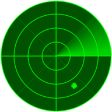
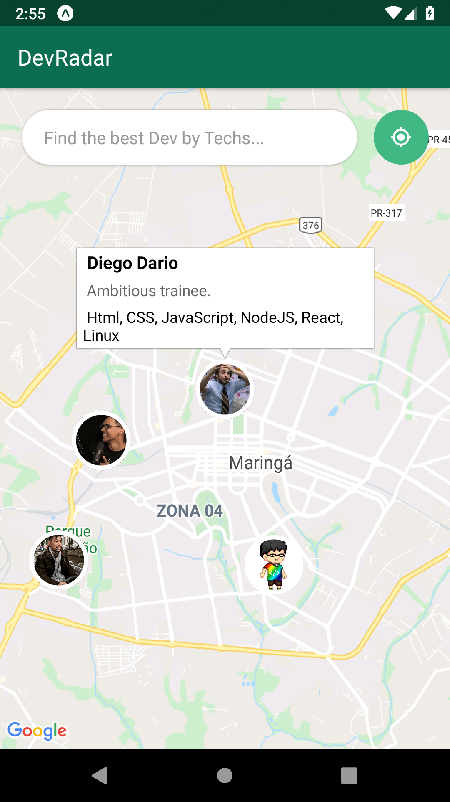

<!-- PROJECT LOGO -->
<br />
<p align="center">
  <a href="https://google.com/">
    
  </a>

  <h3 align="center">Radar Dev  WEB</h3>

  <p align="center">
    Projeto mobile criado para consumir a API via socket-io.
    <br />
    
  </p>
</p>

### About
Projetado para suprir minimamente a interação do usuário, esse modelo cria interfaces comuns de design de mobile e permite distribuir rapidamente seus dados. Esse mobo app faz parte do projeto OminiStack. 

### Features
+ Versioning
+ Support for various data stores
+ Tests
+ Flexibility
+ Extensibility
+ The Javascript you know and love
+ Minimal abstractions


### Print Screen
<p align="left">
  <a href="https://google.com/">
    
  </a>


### Install
````
git clone https://github.com/diegodario88/Radar-Dev-MOBO.git

cd Radar-Dev-MOBO

npm install

````

### Start
````
npm start
````

### Author
[Diego Dario](https://github.com/diegodario88).

### License
MIT.
